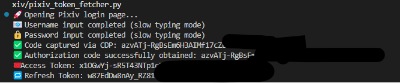

# Pixiv OAuth Token Fetcher

🌍 [English](README.md) | [简体中文](README.zh-CN.md)

A Python automation tool using Playwright to simulate Pixiv OAuth login, capture authorization code, and exchange it for an access token.

---

## 📦 Features

- ✅ Automated Pixiv login (username/password)
- ✅ Console-based code capture
- ✅ Access token & refresh token retrieval
- ✅ Slow typing to bypass bot detection
- ⬜ Supports ~~headless~~ and visible mode

---

## 🚀 Installation

### 1. Clone the repository

```bash
git clone https://github.com/yourname/pixiv-token.git
cd pixiv-token
```

### 2. Install dependencies

Recommended Python version: `>=3.8`

```bash
pip install -r requirements.txt
playwright install
```

Sample requirements.txt:

```txt
requests==2.32.2
playwright>=1.51.0
```

---

## ⚙️ Usage

Edit and run `pixiv_token_fetcher.py`:

```python
if __name__ == "__main__":
    fetcher = PixivTokenFetcher(
        username="your_pixiv_email",
        password="your_pixiv_password",
        headless=False
    )
    code = fetcher.fetch_code()
    if code:
        token_info = fetcher.exchange_token(code)
        print("Access Token:", token_info.get("access_token"))
        print("Refresh Token:", token_info.get("refresh_token"))
```

---

## 📌 Notes

- ⚠️ Do not hardcode credentials in production environments.
- ❌ This is not an official Pixiv SDK.
- 🛡 Please comply with Pixiv's Terms of Service.

---

## 🧪 Example Output



---

## 📝 License

See the [LICENSE](LICENSE) file for license rights and limitations (MIT).

---

## 🙋‍♀️ Contribution & Issues

Pull Requests and Issues are welcome!

---

## 📫 Contact

- GitHub: [piglig](https://github.com/piglig)
- Email: zhu1197437384@gmail.com
